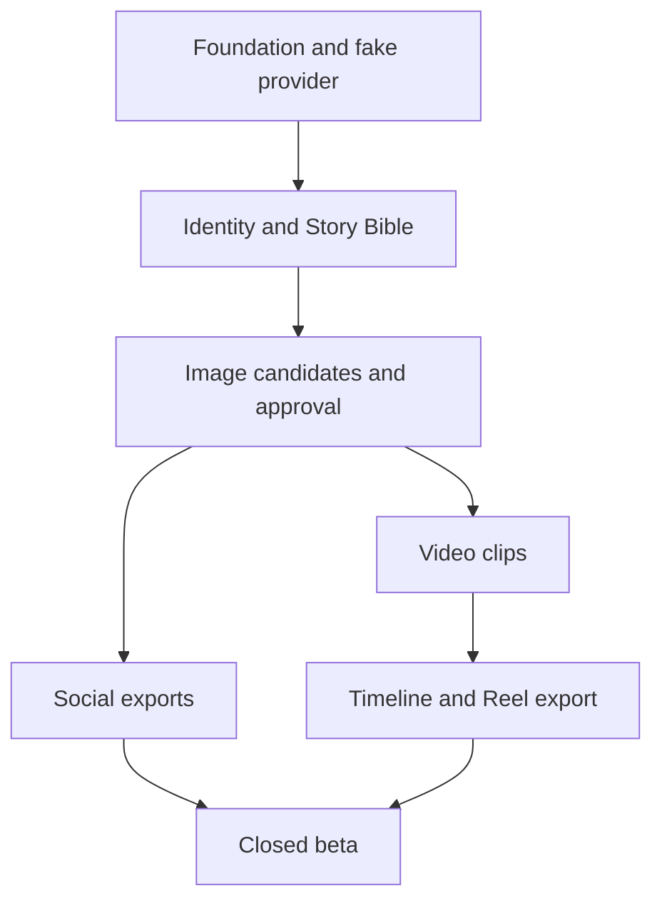

# Roadmap and work breakdown

Planning horizon is indicative, not a committed delivery date. Sequence is dependency-based; parallelize only after contracts and data ownership are stable. Each phase ends in a demonstrable gate.

## Phase 0 — Foundation and evidence (1–2 weeks)
- Repo conventions, CI, basic app shell, auth, migrations, storage, queue, provider interfaces and deterministic fake provider.
- Create consenting evaluation set and benchmark at least two image approaches for likeness and continuity, cost and latency.
- Decide retention/region, provider data terms and export provenance mechanism; record ADRs.
**Exit:** one end-to-end fake-provider experience and selected image provider with documented evidence.

## Phase 1 — Photo experience MVP (2–4 weeks)
- Identity enrollment with quality checks and deletion.
- Experience wizard, storyboard, versioned Story Bible, scene jobs, candidate review and approval.
- Scoped repair and stale dependency handling.
- Carousel, Stories, editable captions, export pack.
- **P11 per-image composer:** demo includes six platform previews, independent text drafts, tone templates and per-image text export. Next: focal crops, rendered overlays/platform-sized downloads, durable drafts and caption-provider adapter. [Scope and acceptance](SOCIAL_COMPOSER.md).
**Exit:** consenting test users finish the functional walkthrough; image release gates in PRD and evaluation plan pass.

## Phase 2 — Video and Reel (2–4 weeks)
- Benchmark image-guided video providers with approved stills.
- Short scene clips, review/retry, timeline editor, soundtrack rights, rendering and video export.
- Cost guardrails, stalled-job recovery and temporal consistency evaluation.
**Exit:** end-to-end Reel from approved scenes with acceptable likeness and measured cost.

## Phase 3 — Closed beta and polish (2–3 weeks)
- Privacy and security review, abuse workflows, accessibility and RTL checks.
- Closed beta analytics, latency/cost optimization, onboarding improvements, support tooling.
- Pricing tests informed by actual cost per approved experience.
**Exit:** beta guardrails and incident/deletion runbooks reviewed; no unresolved P0 defects.

## Later candidates
Optional direct publishing with explicit account permissions; multi-person stories with consent per person; longer director-mode films; native mobile wrapper; templates and localization. Each requires its own business and risk evaluation.

## Dependency map

## Definition of done for every issue
- Acceptance criteria demonstrated in PR description, no hidden cross-user data access.
- UI paths cover loading, empty, error and recovery states; keyboard access where relevant.
- Server paths validate owner, version and idempotency; structured redacted errors.
- Tests cover a genuine failure mode, not implementation mirroring.
- Cost, retention and provider behavior documented when affected.
- Docs and API contract updated; issue linked; reviewer can run a deterministic demo.
