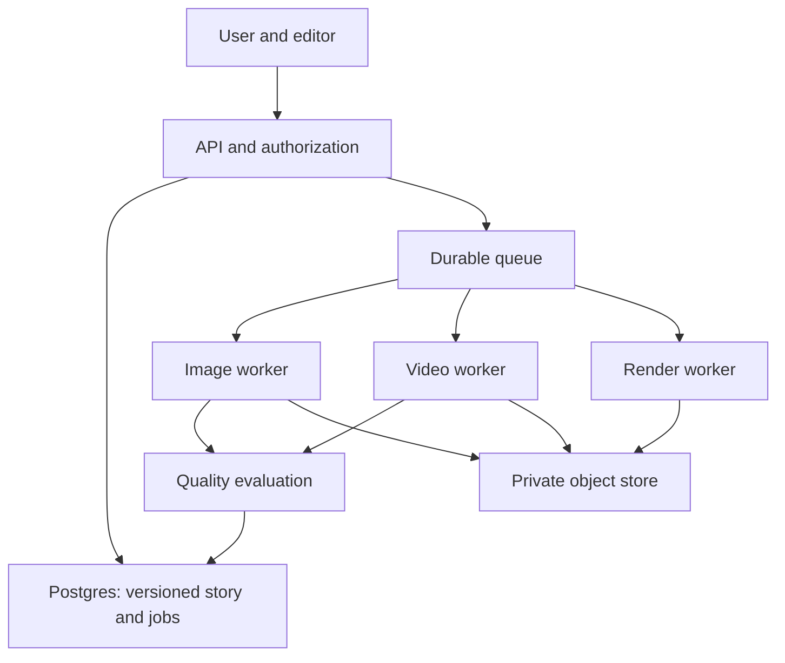

# Technical design

Version 0.2 · Architecture companion to the authoritative [stack decision](STACK.md). When an implementation choice differs, STACK.md controls.

## 1. Stack and boundaries

- Web: Next.js 16 App Router + TypeScript, responsive editor, Better Auth, accessible components.
- API: Next.js Route Handlers with Zod contracts and per-user authorization on every object. Workers scale separately; no second API service in MVP.
- DB: Postgres + Prisma migrations. Object storage for originals, normalized inputs, candidates and exports; bucket private, encryption at rest, short-lived scoped URLs.
- Queue: Redis + BullMQ durable jobs; dedicated workers for image, evaluation, video and render. Web requests never wait for model jobs.
- Render: FFmpeg worker for crops, sequence, captions, audio normalization and ZIP. Pin versions/container images.
- Auth: Better Auth with Prisma adapter and email sign-in initially; no biometric authentication claim.
- Observability: traces by job ID, structured errors, provider latency/cost counters, redacted logs.

Boundary rule: core domain depends on `ImageProvider`, `VideoProvider`, `TextProvider`, `AssetStore` interfaces, never vendor-specific response types. Start with FLUX.2 [pro] for image experiments and Runway image-to-video in Phase 2, both behind replaceable adapters. Issue #5 validates image quality before release; provider terms and region remain an ADR. See [evaluation](EVALUATION.md).

## 2. Logical pipeline

Request flow: validate -> authorize -> snapshot Story Bible and inputs -> compute idempotency key -> reserve estimated budget -> enqueue -> dispatch provider -> store response privately -> evaluate -> publish candidate status -> user approval -> render selected assets.

## 3. Data model (minimum)

`users(id, auth_subject, created_at, deleted_at)`
`identity_profiles(id, user_id, current_version, consent_version, consent_at, status)`
`reference_images(id, profile_id, version, kind, object_key, quality_json, created_at, deleted_at)`
`experiences(id, user_id, title, status, current_bible_version, created_at)`
`story_bibles(id, experience_id, version, facts_json, parent_version, created_at)`
`scenes(id, experience_id, ordinal, spec_json, bible_version, created_at)`
`assets(id, experience_id, scene_id?, type, status, object_key?, parent_asset_id?, bible_version, provider_job_id?, checks_json?, approved_at?, created_at)`
`jobs(id, user_id, experience_id, kind, input_hash, state, attempts, lease_until?, provider, provider_job_id?, error_code?, cost_estimate?, cost_actual?, created_at)`
`exports(id, experience_id, manifest_json, object_key, bible_version, created_at, expires_at)`
`audit_events(id, user_id, action, target_id, timestamp)`

All tables have indexes on owner/experience/status. Composite owner checks in queries; no asset fetch by ID without ownership. Blob names are random and never email/name-based. Bible and approval histories are append-only; soft-delete coordination uses tombstones, then hard deletion under policy. Use a transaction/outbox for job creation and state change.

## 4. API sketch

`POST /v1/uploads/init` -> scoped URL and upload ID; `POST /v1/uploads/:id/complete` -> validation job.
`POST /v1/identity-profiles`; `GET /v1/identity-profiles/current`; `DELETE /v1/identity-profiles/current`.
`POST /v1/experiences`; `GET /v1/experiences/:id`; `PATCH /v1/experiences/:id/bible` with expected version; `POST /v1/experiences/:id/scenes`.
`POST /v1/scenes/:id/generations` with idempotency key; `POST /v1/assets/:id/approve`; `POST /v1/assets/:id/repair` with mask ID and parent version.
`POST /v1/scenes/:id/clips`; `PUT /v1/experiences/:id/timeline`; `POST /v1/experiences/:id/exports`.
`GET /v1/jobs/:id`; `POST /v1/jobs/:id/cancel`; `GET /v1/exports/:id/download` -> short-lived URL.
`DELETE /v1/account` -> irreversible deletion workflow with confirmation in UI.

Return consistent `{code,message,details,requestId}` errors. Check owner and version before all mutations. Rate-limit uploads/generation. Webhook callbacks, if used, validate signatures and replay windows.

## 5. Story Bible and dependency invalidation

Facts are typed (person profile version, place anchors, location reference ID, outfit, time/weather, tone, constraints). Every scene stores the Bible version it was planned against; every generation stores the scene spec hash and input reference hashes. Build dependency edges: profile -> scene assets -> clips -> timeline -> exports; Bible field changes mark only dependent descendants stale. User approval does not auto-transfer to regenerated descendants. Workers reject stale input snapshots before publishing output.

## 6. Image generation

Select 2–5 reference images based on pose/angle, quality and diversity; include destination reference if exact place requested. Ask provider for modest candidate batches. Preserve face/body proportions, wardrobe, ambient light and scene composition. Do not rely on prompts alone for identity. Run face match against several user references as advisory score; detect faces/hands/text artifacts; use human/user review for final acceptance. Region repair takes mask, approved parent image and fixed context; prevent unintended edits outside mask via image difference gate. Store provider model/version, prompt template version and seed if available for reproducibility.

## 7. Video and assembly

Use approved image as start/keyframe, simple motion prompt and consistent scene references. Generate short clips asynchronously. Analyze sampled frames for face drift, extra limbs, temporal flicker and location continuity. For larger edits, regenerate only a clip; never mutate approved image. FFmpeg assembles clips, trims/transitions, burns optional captions, mixes licensed/user-owned audio, and outputs H.264 MP4 with browser-friendly settings. Separate narration/voice features require explicit consent and their own release gate.

## 8. Security, privacy and provenance

Images of faces are sensitive. Encrypt storage and backups; restrict service identities to job-specific buckets; never log raw images, embeddings, signed URLs or prompts containing personal data. Signed URLs expire quickly. Strip original EXIF from derivative media; never fabricate capture metadata or GPS. Maintain audit trail, deletion tombstone, cascading object deletion and backup expiry policy. Publish actual retention and provider data-use terms before beta.

Allow only consented adult likeness. Abuse review prevents unconsented impersonation, minors, forged evidence or official records, sexual exploitation and misleading endorsement. Export synthetic provenance (Content Credentials/C2PA where supported), visible AI disclosure in sharing flows, and manifest. Preserve provenance across re-encoding where technically possible; do not promise metadata survives all social platforms.

## 9. Cost and reliability controls

Per-user and per-experience spend limits; quote an estimated range before expensive video. Cache approved immutable assets, not private cross-user inputs. Deduplicate jobs by hash, bounded retries, exponential backoff, provider circuit breaker, dead-letter queue and operator replay with authorization. Record actual provider billable units per attempt and cost per approved session. Set alarms for stalled jobs, retry storms, orphaned blobs and deletion failures. Define retention for rejected candidates and exports separately.

## 10. Testing and delivery

Contract tests for provider adapters with recorded redacted fixtures; transactional tests for ownership/version conflict, idempotency, deletion during running jobs and stale result rejection. Golden tests for crop/render and export manifest. E2E happy path with deterministic fake providers, no paid calls in CI. Real-provider benchmark runs on consented test set only. CI: lint, typecheck, tests, migration validation, dependency scanning and secret scanning. Preview environments use synthetic fixtures. Roll out behind feature flags and quota caps.
